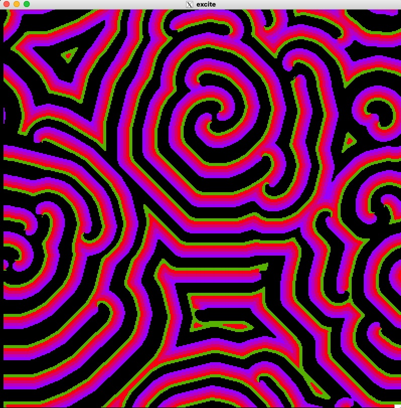

# Excitable Cellular Automata

This code simulates the Excitable Cellular Automata [1]. It uses [GSL](https://www.gnu.org/software/gsl/) for the random number generator and [EGGX](https://www.ir.isas.jaxa.jp/~cyamauch/eggx_procall/index.html) for graphics. Type 'make' in the program directory to compile the code.

[1] [Asymptotic behavior of excitable cellular automata](https://projecteuclid.org/journals/experimental-mathematics/volume-2/issue-3/Asymptotic-behavior-of-excitable-cellular-automata/em/1062620830.full)

